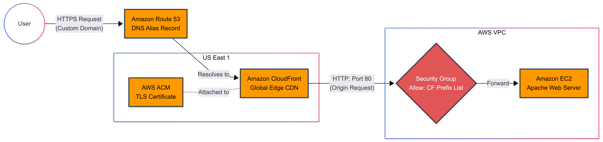

# Global Content Distribution: Edge-Optimized Architecture

## Objective

This project deploys a highly available, globally distributed delivery network for a multi-page frontend application built with HTML, Tailwind CSS, and JavaScript. The architecture uses Amazon CloudFront to cache and route content from global edge locations, enforces HTTPS for viewer traffic, and protects the origin server so that application traffic can only reach it through CloudFront.

The frontend application is hosted on an Amazon EC2 instance running Nginx. CloudFront is configured with the EC2 instance as a custom origin, Amazon Route 53 manages DNS resolution for the custom domain, and AWS Certificate Manager provides the TLS certificate used by CloudFront for secure HTTPS delivery.

## Services Used

| Service | Role in the Architecture |
| --- | --- |
| Amazon EC2 | Hosts the multi-page frontend application on an Amazon Linux instance. |
| Amazon CloudFront | Provides global content delivery, edge caching, HTTPS enforcement, and routing to the EC2 origin. |
| Amazon Route 53 | Manages DNS records for the custom domain and routes apex and `www` traffic to the CloudFront distribution using alias records. |
| AWS Certificate Manager | Issues and manages the public TLS certificate used by CloudFront for HTTPS traffic. The certificate is created in `us-east-1` for CloudFront compatibility. |
| Amazon VPC | Provides the networking layer for the EC2 origin, including security group controls and managed prefix list rules. |
| EC2 Security Groups | Restrict inbound access to the EC2 origin. SSH is limited to the administrator IP, and HTTP access is limited to CloudFront origin-facing IP ranges. |
| AWS Managed Prefix List for CloudFront | Allows the EC2 security group to accept HTTP traffic only from CloudFront origin-facing infrastructure. |

## Architecture Flow

<!-- Cntrl+click edge.png -->

 

### How the System Works

1. A user visits the custom domain, such as `awswithme.shop` or `www.awswithme.shop`.
2. Amazon Route 53 resolves the domain through alias A records that point to the CloudFront distribution.
3. CloudFront receives the viewer request and enforces HTTPS using the ACM certificate attached to the distribution.
4. If the requested file is already cached at the nearest CloudFront edge location, CloudFront serves it directly to the user.
5. If the object is not cached, CloudFront forwards the request to the EC2 origin.
6. The EC2 security group accepts HTTP traffic only from the AWS Managed Prefix List for CloudFront origin-facing servers, preventing direct public access to the origin over port 80.
7. Nginx serves the requested frontend files from the EC2 instance.
8. CloudFront caches the response at the edge and returns it to the user, improving performance for future requests.

## Cost Analysis

This architecture is designed to operate within the AWS Free Tier for eligible accounts and usage levels. The EC2 instance uses a Free Tier eligible instance type, CloudFront usage can remain within Free Tier transfer and request limits, and ACM public certificates used with CloudFront do not add certificate charges.

The custom domain is the primary non-Free Tier requirement because it must be purchased from a domain provider. Always verify the latest AWS Free Tier limits, Route 53 hosted zone costs, DNS query charges, and domain registration pricing before running the project long term.

## Key Engineering Decisions

### Edge Caching: CloudFront

CloudFront was implemented to drastically reduce latency by caching static assets at global edge locations. This brings content closer to users around the world and minimizes repeated requests to the EC2 origin, reducing compute load on the Nginx server.

### Origin Protection: Prefix Lists

The EC2 security group was configured to accept inbound HTTP traffic only from the AWS Managed Prefix List for CloudFront origin-facing infrastructure. This prevents users or bad actors from bypassing CloudFront and accessing the EC2 origin directly through its public IP address or public DNS name.

### SSL Termination: ACM and CloudFront

TLS is terminated at the CloudFront edge using a public certificate issued by AWS Certificate Manager. This ensures users connect securely over HTTPS while offloading certificate handling and cryptographic processing from the EC2 instance. In this implementation, CloudFront connects to the Nginx origin over HTTP port 80, with the origin protected by the CloudFront prefix-list security group rule.

## Implementation Snapshot

- Application type: Multi-page frontend application
- Frontend stack: HTML, Tailwind CSS, JavaScript
- Origin server: Amazon EC2 running Nginx
- EC2 instance name: `myLinuxVM`
- Instance type: `t3.micro`
- AMI: Amazon Linux 2023
- Nginx web root: `/usr/share/nginx/html`
- CloudFront distribution name: `my-cloudfront-origin-server`
- Custom domains: `awswithme.shop`, `www.awswithme.shop`
- Viewer protocol policy: Redirect HTTP to HTTPS
- Origin protocol: HTTP only
- DNS routing: Route 53 alias A records to CloudFront
- Origin ingress control: `com.amazonaws.global.cloudfront.origin-facing` AWS Managed Prefix List

## Security Posture

- HTTPS is enforced for all viewer traffic at CloudFront.
- The ACM certificate is managed centrally and attached to the CloudFront distribution.
- The EC2 origin does not accept general public HTTP traffic.
- SSH access is restricted to the administrator IP address.
- CloudFront acts as the only public entry point for the frontend application.

## Outcome

The result is a decoupled, edge-optimized content delivery architecture that separates DNS resolution, TLS termination, CDN caching, and origin compute. This improves global performance, reduces direct load on the EC2 instance, and establishes a stronger security boundary around the origin server.
